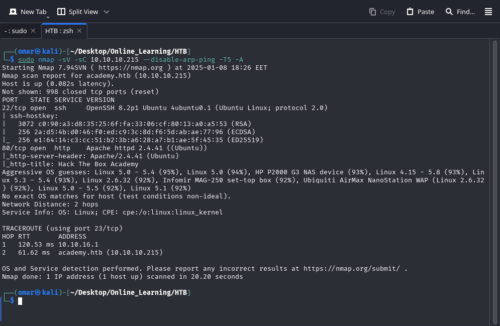
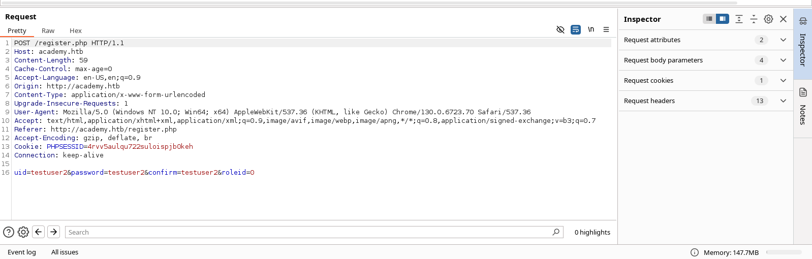
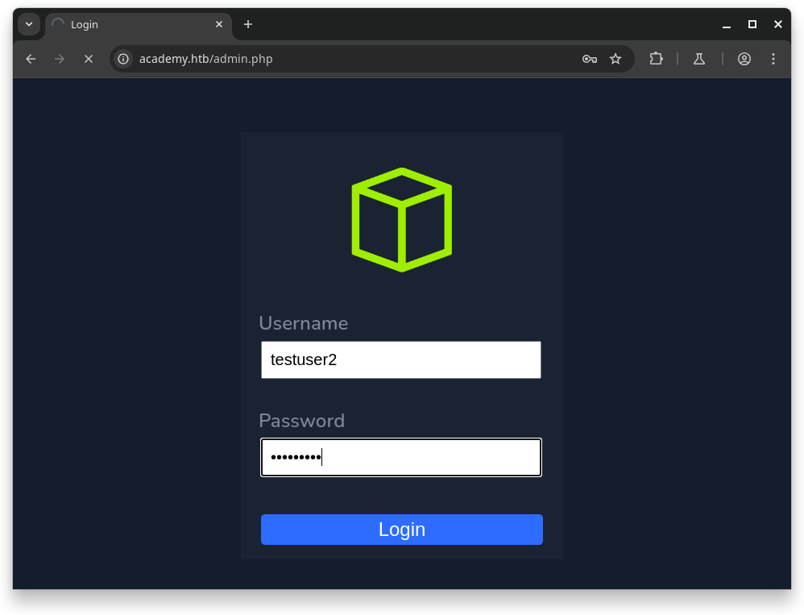
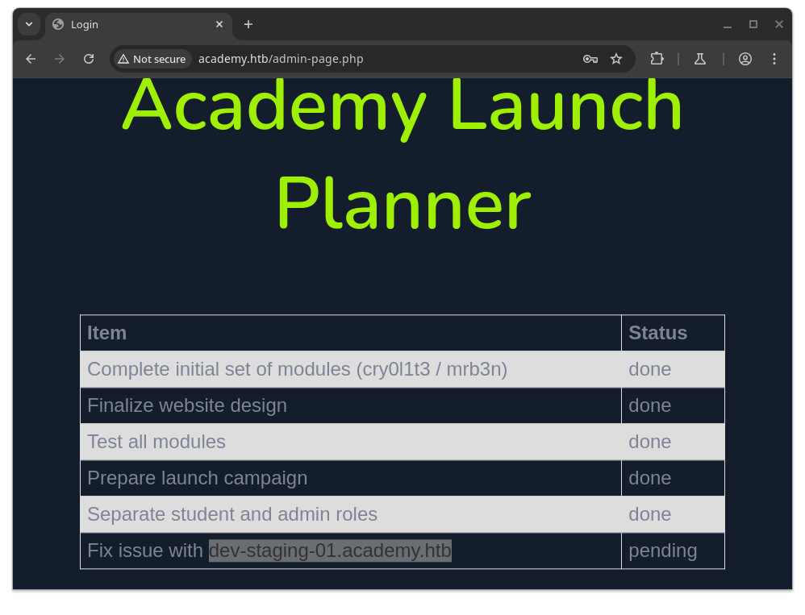
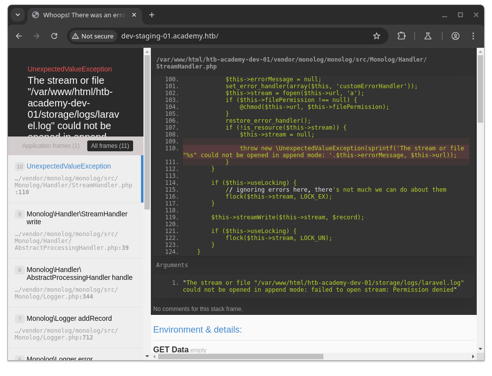
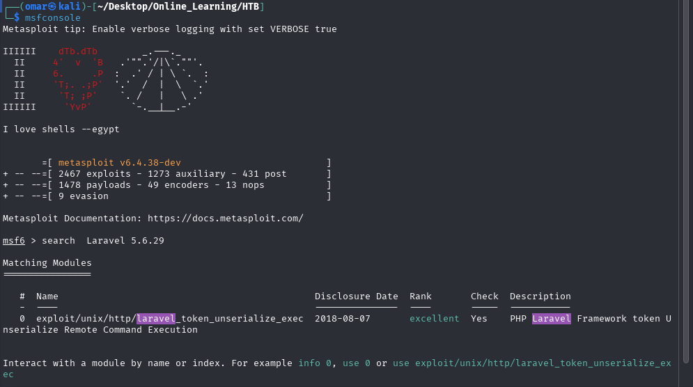
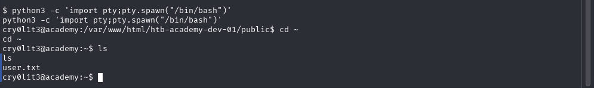
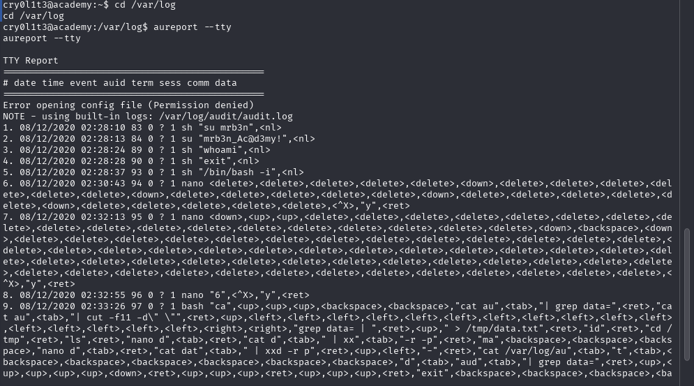
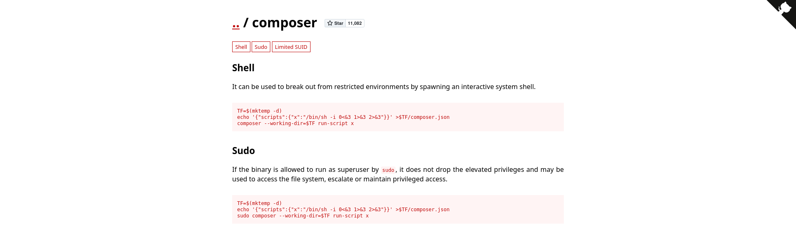
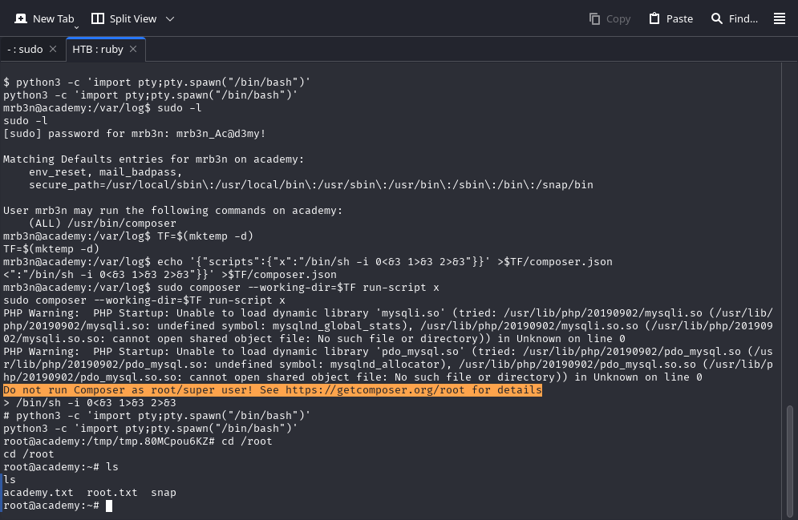

## Nmap Scan



The ```Nmap``` Scan reveals port 22 and 80 open both respectfully for ssh and HTTP with an ```Apache``` web server running on port 80

---
## Enumeration


Enumerating the web page we find a ```register``` directory where the role of the user is determined using a parameter ```roleid``` wwe try changing the that pararmeter to ```1``` and check if we are registered as ```admin```.



we move to the ```admin``` log in page and try to use the parameter we used to register and we successfully login.



we find in the admin interface that there is a subdomain ```dev-staging-01.academy.htb``` that we didn't find during web enumeration we add the new subdomain to ```/etc/hosts``` and move to it.

---
## Foothold



moving to the webpage we find that it uses an old version of laravel that has an RCE with reference number ```CVE-2018-15133``` . we will be using ```msfconsole``` to exploit this webpage.


the exploit is successful , and after some enumeration we find the user ```cry0l1t3``` password 


after logging in using the credentials we found we successfully get the first flag.



---
## Lateral Movement

we move to the logs file and view them to find exposed credentials of the user ```mrb3n```


we use the credentials we found to move to the new user.

---
## Privilege Escalation

we first check for misconfigured sudo

we find that the new user can run the binar ```composer``` without a password.

we check the ```GTFO bins``` for the binary file to find the following [Composer](https://gtfobins.github.io/#composer)


we use the following commands that we found to escalate our privileges 
```
TF=$(mktemp -d)
echo '{"scripts":{"x":"/bin/sh -i 0<&3 1>&3 2>&3"}}' >$TF/composer.json
sudo composer --working-dir=$TF run-script x 
```

---
## System Pwn



we successfully escalate our privilege and get the final ```root``` flag.
