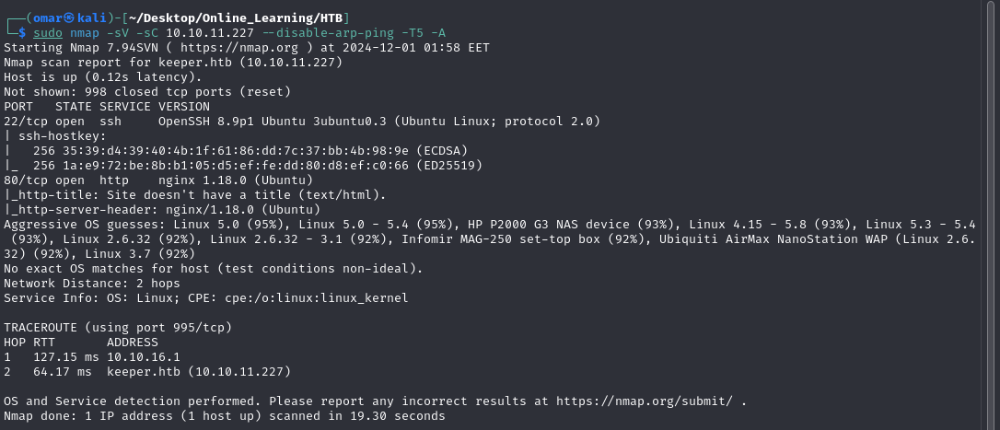
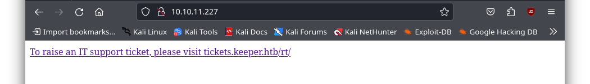
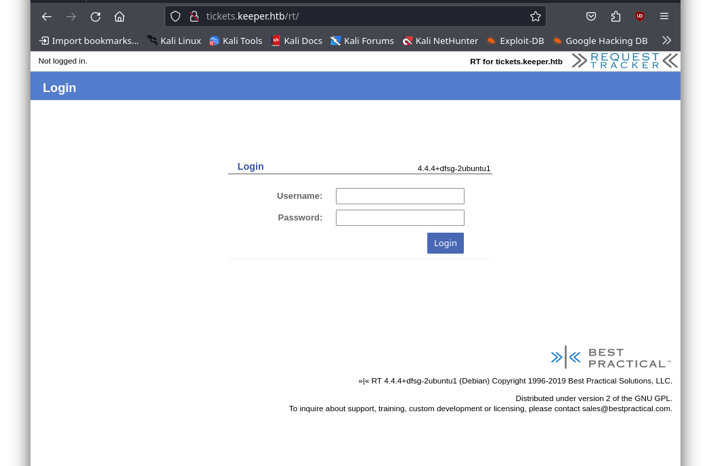
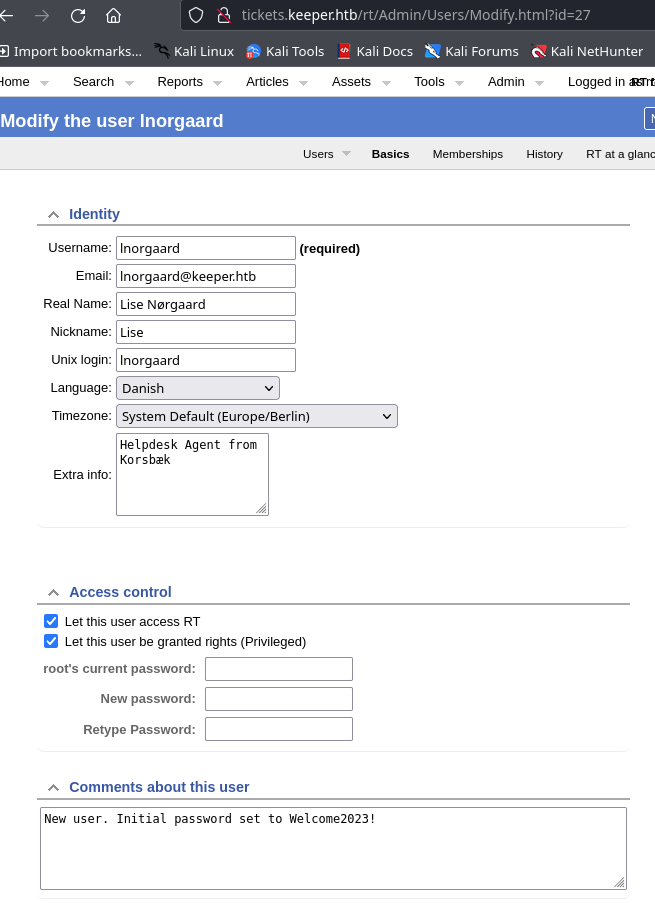
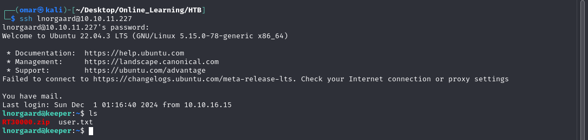
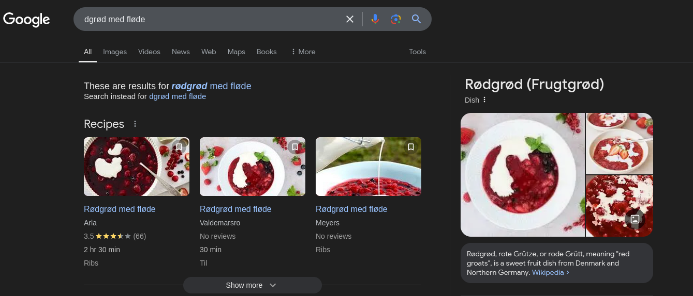
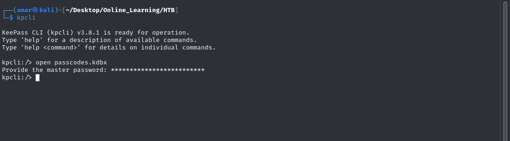
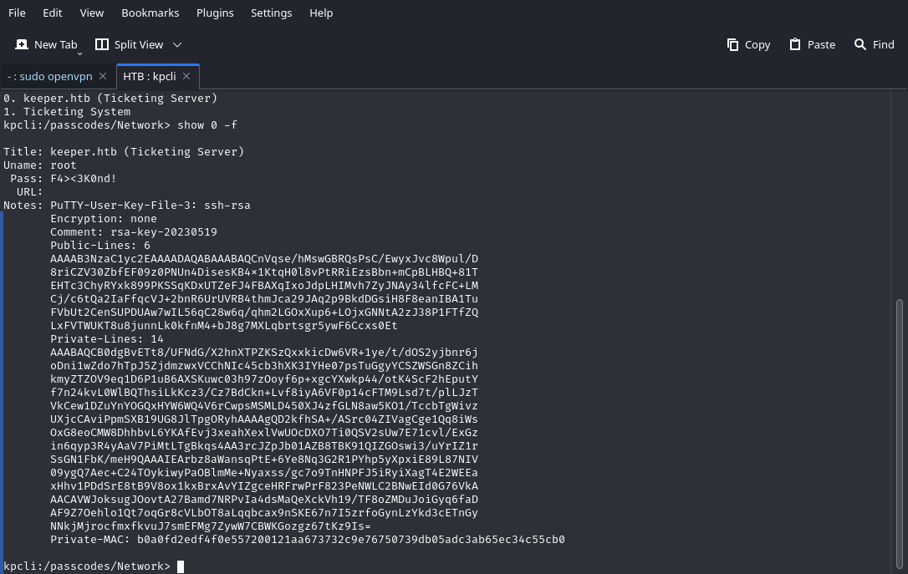
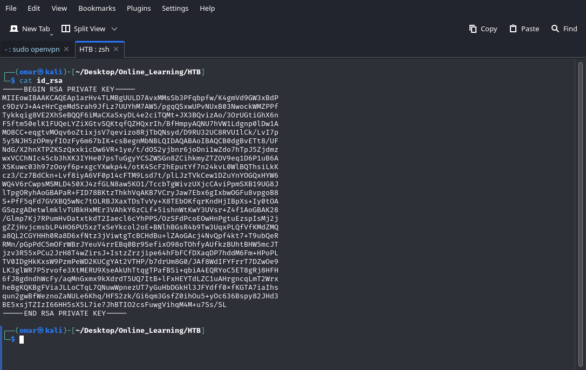
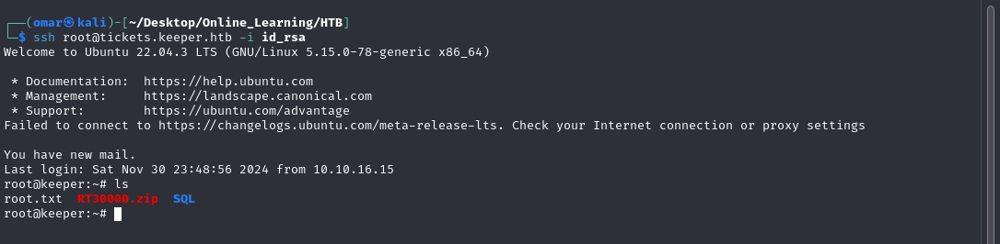

## Nmap Scan
---


The ```Nmap``` Scan reveals port 22 and 80 open both respectfully for ssh and HTTP with an ```Nginx``` web server running on port 80

## HTTP
---
Browsing the web page we find a link that directs us to the subdomain ```tickets.keeper.htb```

we add the subdomain to ```/etc/hosts``` the visit it to find a login page hosting ```Request Tracker```

A quick search reveals that the default credential are ```root``` and ```password```.
## Foothold
---
Enumerating the host we find another user with the name ```Inorgaard``` where his comment section reveals that his password is ```Welcome123!```.

we use the found credentials to ssh into the machine and find the user flag


## Privilege Escalation
---
In the home directory we find a zip file along side the flag ,  unzipping its contents we find two files ```KeePassDumpFull.dmp``` and ```passcodes.kdbx``` we ```scp``` to download the file to our machine using this command
```scp lnorgaard@10.10.11.227:/home/lnorgaard/RT30000.zip .``` In order to exploit the dump we need to use a dotnet package which can be found in [package](https://github.com/vdohney/keepass-password-dumper.git)

Running the package we find a potential password ```dgrød med fløde``` we run a search on this and find the phrase ```rødgrød med fløde``` which is mopst likely the correct password


We try to open ```passcodes.kdbx``` using the password we just found and it's a success


Navigating the database we found some putty formatted ssh keys in the ```Network``` directory.

we save this to a file and use ```puttygen``` to generate ssh key for the root user.
```
puttygen private-key -O private-openssh -o id_rsa
chmod 600 id_rsa
```

Finally we use the generated ```ssh``` key to get root access
```ssh root@tickets.keeper.htb -i id_rsa```
